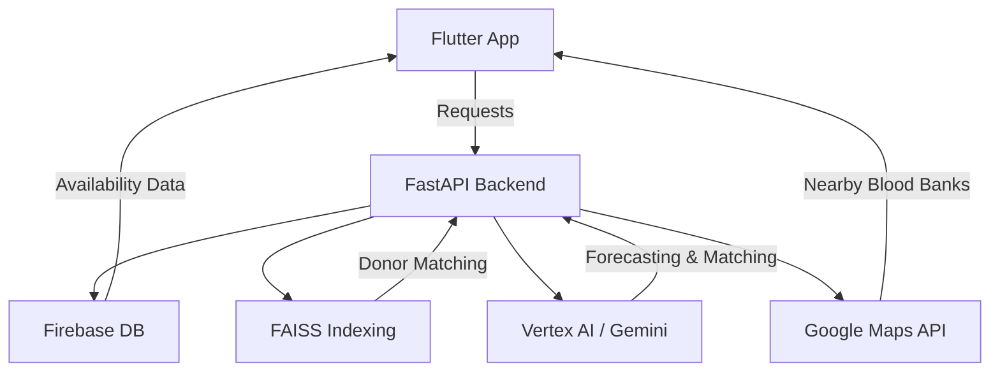

# 🩸 AI-Driven Blood Donation Network

Welcome to the **AI-Driven Blood Donation Network** — a powerful, life-saving platform using **AI and real-time data** to revolutionize blood donation systems. Built with a modern tech stack, this project ensures timely and efficient blood availability tracking, donor matching, and demand forecasting.

---

## 🚀 Key Features

* 🔍 **Real-Time Blood Availability Tracking**: View blood stock across blood banks live.
* 🧠 **AI-Driven Matching**: Efficiently match donors and banks using **Vertex AI** + **FAISS** indexing.
* 🔔 **Smart Notifications**: Alert registered donors when their blood type is urgently needed.
* 📈 **Blood Demand Forecasting**: Predict future shortages using AI/ML models.
* 📍 **Location-Aware Recommendations**: Find nearby banks using **Google Maps** integration.

---

## 🧰 Tech Stack

| Layer          | Technology                          |
| -------------- | ----------------------------------- |
| **Frontend**   | Flutter                             |
| **Backend**    | FastAPI                             |
| **Database**   | Firebase                            |
| **AI/ML**      | Vertex AI, LangChain, Gemini, FAISS |
| **Data Tools** | Pandas                              |
| **Maps**       | Google Maps API                     |

---

## 🧱 Project Structure

```
Power_Rangers/
│
├── agents/                  # Backend AI engine
│   ├── app.py               # FastAPI app
│   ├── agents.py            # AI/FAISS logic
│   ├── bloodbank.json       # Raw data
│   ├── converted_bloodbank.json # Processed data
│   ├── requirements.txt
│
└── app/blood_donation/      # Flutter frontend
    ├── android/
    ├── ios/
    └── lib/
```

---

## 🧪 Mermaid Diagram (System Architecture)



---

## ⚙️ Getting Started

### 🔧 Prerequisites

* Python 3.7+
* Flutter SDK
* Firebase Account
* GCP Account (for Vertex AI & Maps)

---

### 🖥 Backend Setup

```bash
cd Power_Rangers/agents
pip install -r requirements.txt
uvicorn app:app --reload
```

### 📱 Frontend Setup

```bash
cd Power_Rangers/app/blood_donation
flutter pub get
flutter run
```

---

## 💻 Usage

👤 **Donor**

* Track real-time availability
* Get alerts when needed
* Book donation appointments

🏥 **Agent / Admin**

* Manage availability data
* Confirm appointments
* Analyze demand trends

---

## 📸 Screenshots

<table>  
  <tr>  
    <td></td>  
    <td></td>  
    <td></td>  
  </tr>  
  <tr>  
    <td></td>  
    <td></td>  
    <td></td>  
  </tr>  
  <tr>  
    <td></td>  
    <td></td>  
  </tr>  
</table>

---

## 🧠 AI Components

* **FAISS** for donor-to-bank similarity searches.
* **LangChain + Gemini** to provide intelligent insights.
* **Vertex AI** for blood demand prediction.

---

## 🧬 API Integration

We use data from [data.gov.in](https://api.data.gov.in/resource/fced6df9-a360-4e08-8ca0-f283fc74ce15?api-key=579b464db66ec23bdd000001603eb0cc38324dd768735197a75609f5&format=json&limit=2823) to populate and validate blood bank locations and availability.

---

## 🤝 Contributing

1. Fork the repository
2. Create a branch: `git checkout -b feature-name`
3. Make your changes
4. Submit a Pull Request

---

## 📝 License

This project is licensed under the MIT License.
See the [LICENSE](LICENSE) file for full details.

---

## 🙏 Acknowledgments

* Google Cloud, Firebase, and the Open Source community
* Hackathon mentors and reviewers
* Developers & donors working to save lives ❤️

---

Let’s save lives together, intelligently. 🧠🩸
**Made with care and code by Team Power Rangers** 💪
