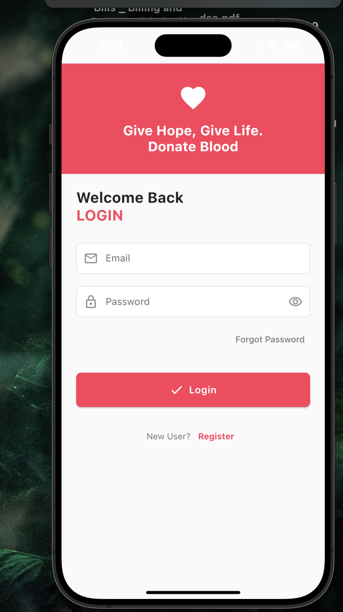
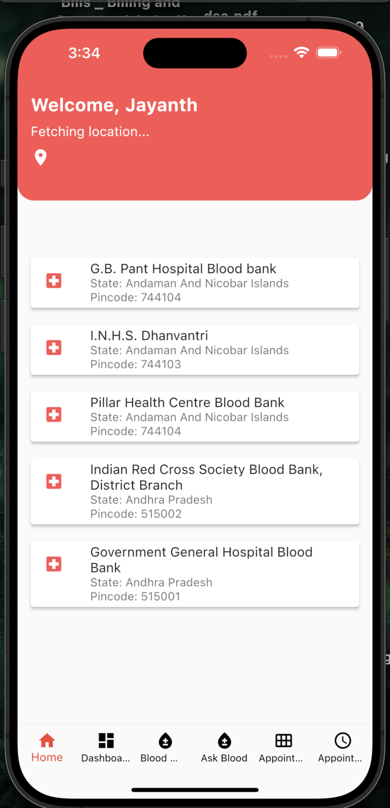
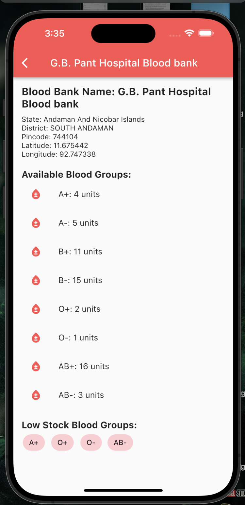
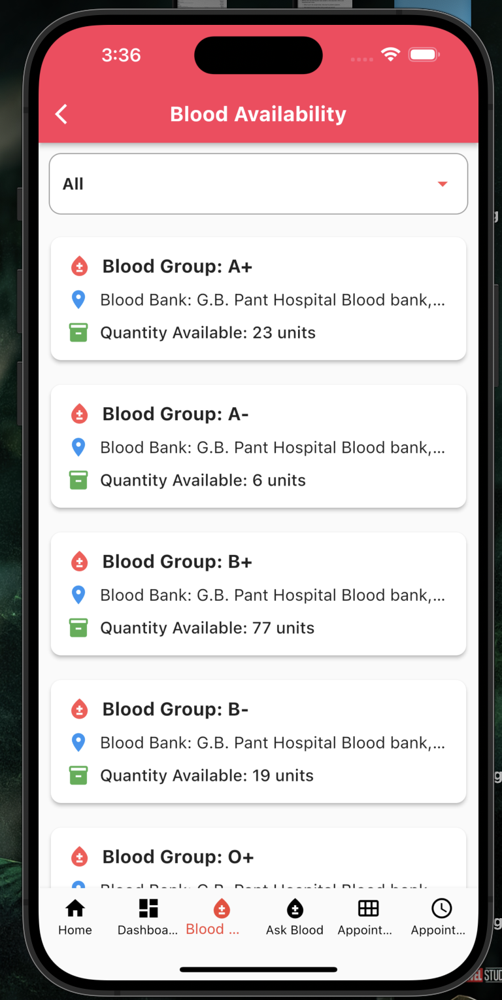
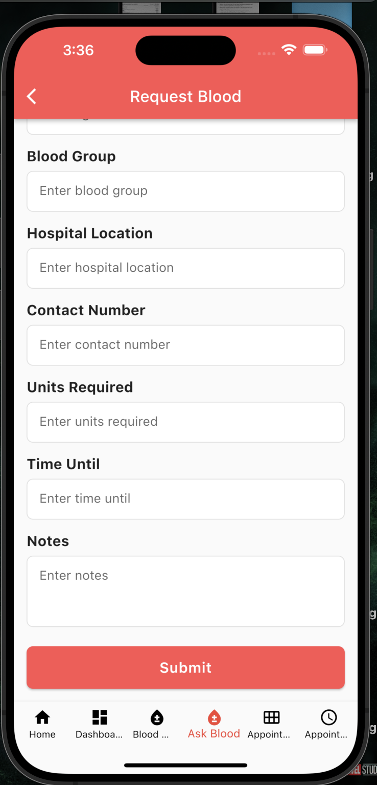
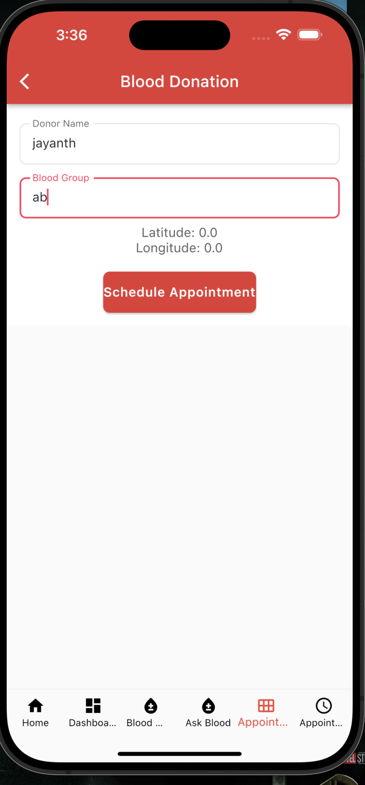
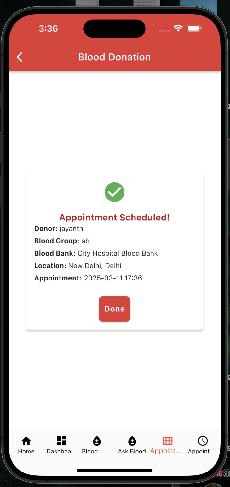
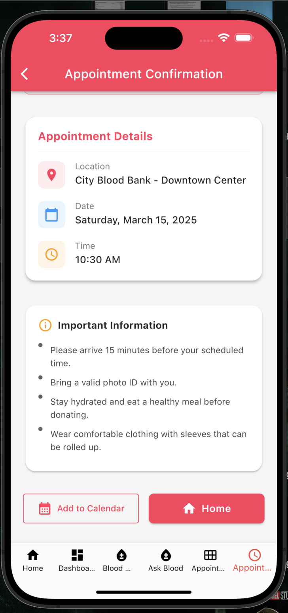

# AI-Driven Blood Donation Network

Welcome to the AI-Driven Blood Donation Network project! This innovative solution aims to revolutionize the way blood donation and availability are managed by leveraging cutting-edge AI technologies. Our platform provides real-time blood availability tracking, AI-driven donor matching, smart notifications, and blood demand forecasting to ensure that blood banks and donors are seamlessly connected.

## Features

1. **Real-time Blood Availability Tracking**: Monitor blood stock levels across various blood banks and donors in real-time.
2. **AI-Driven Matching**: Utilize Vertex AI and FAISS indexing to match donors with blood banks efficiently.
3. **Smart Donor Notifications**: Send timely alerts to donors when their blood type is in demand.
4. **Blood Demand Forecasting**: Predict future blood shortages using advanced AI models.

## Tech Stack

- **Frontend**: Flutter
- **Backend**: FastAPI
- **Database**: Firebase
- **Data Processing**: Pandas
- **AI/ML**: LangChain + Gemini, Vertex AI, FAISS
- **Maps**: Google Maps

## Project Structure

```
agents
    ___pycache__
    chroma_db
    .gitignore
    agents.py
    app.py
    bloodbank.json
    converted_bloodbank.json
    requirements.txt
    test.bloodbanks.json
app
    blood_donation
        android
        ios
        lib
```

## Getting Started

### Prerequisites

- Python 3.7+
- Flutter SDK
- Firebase account
- Google Cloud Platform account for Vertex AI

### Installation

1. **Clone the repository**:
   ```bash
   git clone https://github.com/jayanth119/Power_Rangers.git
   cd Power_Rangers
   ```

2. **Set up the backend**:
   ```bash
   cd agents
   pip install -r requirements.txt
   uvicorn app:app --reload
   ```

3. **Set up the Flutter app**:
   ```bash
   cd app/blood_donation
   flutter pub get
   flutter run
   ```

### Running the Project

1. **Start the backend server**:
   ```bash
   cd agents
   uvicorn app:app --reload
   ```

2. **Run the Flutter app**:
   ```bash
   cd app/blood_donation
   flutter run
   ```

## Usage

- **Blood Donor**: Track real-time blood availability, receive shortage alerts, and schedule appointments.
- **Agent**: Manage user data, blood availability locations, and appointment schedules.

## Contributing

We welcome contributions! Please fork the repository and create a pull request with your changes.


## Acknowledgments

- Thanks to all the contributors and the open-source community for their invaluable support.
- Special thanks to Google Cloud Platform for providing the necessary tools and services.

---

We hope this project impresses the judges and contributes to saving lives through efficient blood donation management. Thank you for your time and consideration!


SCREENSHOTS OF OUR APP:

<!-- display screenshots in assests  -->









